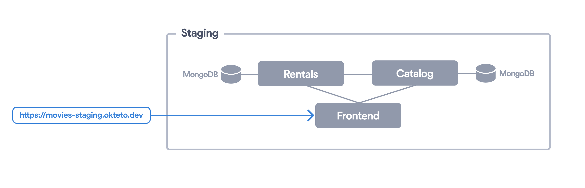

# Movies App

This example shows how to leverage [Okteto](https://github.com/okteto/okteto) to develop an application based on microservices directly on Kubernetes. The Movies App is deployed using a Helm Charts. It creates the following components:

- A *React* based [frontend](frontend), using [webpack](https://webpack.js.org) as bundler and *hot-reload server* for development.
- A [rentals](rentals) service. It has an API and a Worker in Go, a Kafka broker, and a Postgres database.
- A [rent](rent) service. It has an API in Java.
- A [catalog](catalog) service. It has a Node.js API serving data from a MongoDB database.

## Demo script

- Deploy the repo from UI
- Rent two movies
- `okteto up worker` + `make build` + `make start`
- Uncomment line 61 in `rentals/cmd/worker/main.go`
- `make build` + `make start`
- Show how the change is applied

test
