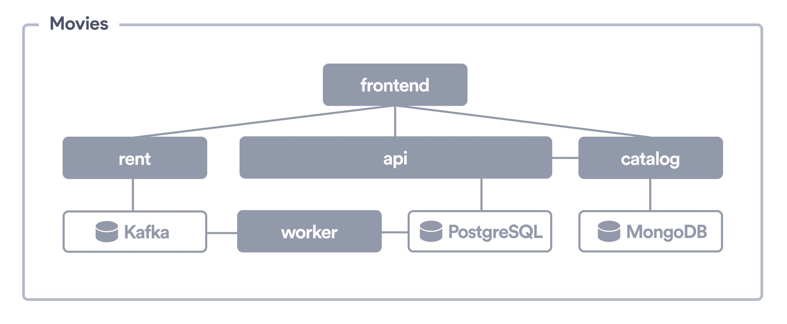

# Movies App

This example shows how to leverage [Okteto](https://github.com/okteto/okteto) to develop an application based on microservices directly on Kubernetes. The Movies App is deployed using a Helm Charts. It creates the following components:

- A *React* based [frontend](frontend) service, using [webpack](https://webpack.js.org) as bundler and *hot-reload server* for development
- A Node.js based [catalog](catalog) service to serve the available movies from a MongoDB database
- A Java based [rent](rent) service to receive rent requests and send them to Kafka
- A Golang based [worker](worker) to process rent request from Kafka and update the PostgreSQL database
- A Golang based [api](api) to handle logins, rentals, rental history, availability and the admin operations on the PostgresSQL database
- A [MongoDB](https://bitnami.com/stack/mongodb/helm) database
- A [Kafka](https://bitnami.com/stack/kafka/helm) queue
- A [PostgresQL](https://bitnami.com/stack/postgresql/helm) database

## Using the app

The catalog is shared by everyone, and every movie has a limited number of copies.

- **Users** sign in with their email (no password, it's a demo). They can rent any movie with copies left, return the ones they have, and see their full rental history.
- **Admins** sign in at `/admin` with `admin` / `admin123`. They can review each user's history, ban and unban users, resolve the "good deed" requests banned users send, and add, edit or remove movies from the catalog.
- **Banned users** get a meme instead of the store, and can ask for forgiveness by describing a good deed for an admin to approve.

The demo credentials and the secret used to sign the session cookies are set per service in the Helm values (`admin.username`, `admin.password`, `sessionSecret`), and read from the `ADMIN_USERNAME`, `ADMIN_PASSWORD` and `SESSION_SECRET` environment variables.

## Development container demo script

- Deploy the repo from UI
- Rent two movies
- `okteto up worker` + `make build` + `make start`
- Uncomment line 61 in `rentals/cmd/worker/main.go`
- `make build` + `make start`
- Show how the change is applied
